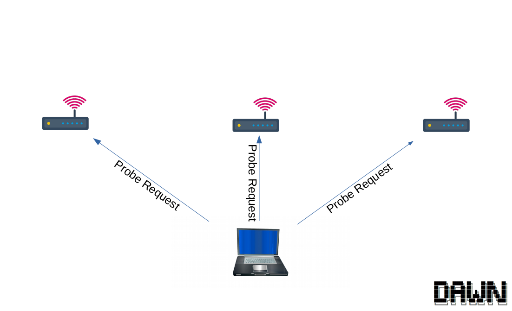
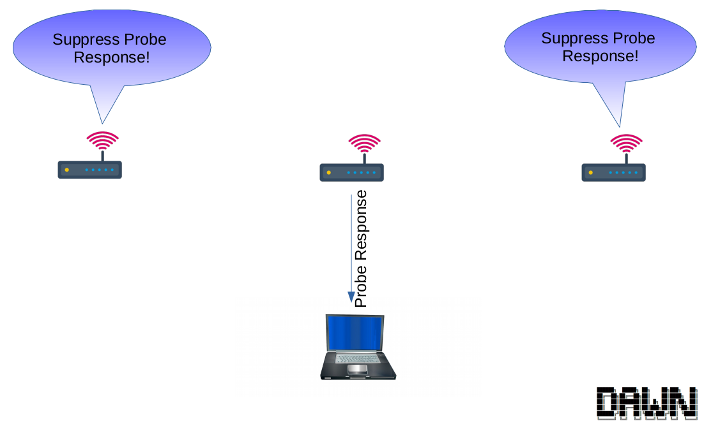

WiFi introduced `802.11k` and `802.11v`. This new admantmends introduced new Radio Resource Managment (RRM) opportunities.  Still, there are a lot of legacy decvices in the wild not supporting those amandments. Esepcially, you find those devices in the `2.4 GHz` ISM band that is highly crowded. In this blog article I will subscribe how to handle with hose legacy devices.

### Associtation Control

|WiFi Association|
|---|
| | 

#### Scanning

Typically, a client devices scans for nearby APs by sending out probe request messages. That process is called `active scanning`. Furthermore, the client has the ability to collect so `becaon frames` to findout other stations. This process is called `passive scanning`.

#### Associtation

#### Deassociation

### Associtation Control

|Scanning|Answering|
|---|---|
|||

